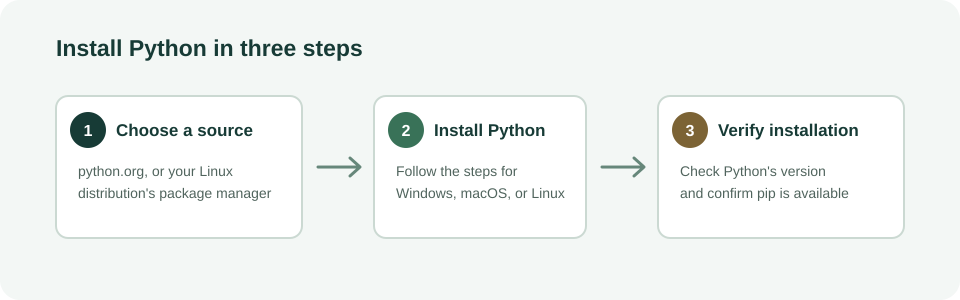

# Installing Python

## Introduction

Python is a general-purpose programming language used for automation, data analysis, web development, education, and many other tasks. Before writing or running Python programs, install a supported Python 3 release and confirm that your computer can find it.

This project provides a practical installation guide for Windows, macOS, and Linux. It is intended for beginners and uses the official Python download site or the package manager supplied by a Linux distribution. Installer screens and available release numbers can change, so always choose a current stable release from the official source rather than an old download linked from a third-party site.

## Software requirements

- A computer running Windows 10 or later, macOS, or a supported Linux distribution.
- An internet connection to download Python or access the operating system's package repositories.
- Permission to install software. On managed computers, an administrator may need to approve installation.
- A terminal: PowerShell or Command Prompt on Windows, Terminal on macOS, or a terminal emulator on Linux.
- Optional: a code editor such as Visual Studio Code. An editor is not required to install or verify Python.

## Installation overview

The steps are: download or select Python from a trusted source, install it using the method for your operating system, and verify the interpreter and package installer from a terminal.

Continue to [Installation](Installation.md) for the complete instructions, or see [Frequently Asked Questions](FAQ.md) for common questions.

## Conclusion

After completing the installation and verification steps, Python is ready to use. For individual projects, create a virtual environment to keep that project's packages separate from other Python work.